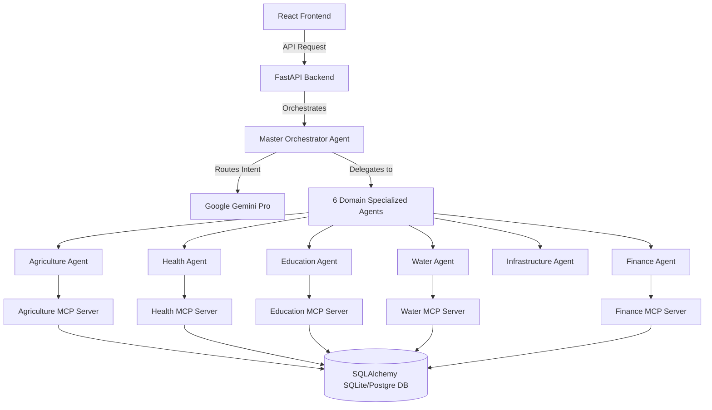

# GraminAI: Smart AI Co-Pilot for Rural Communities

GraminAI (RuralAI) is an intelligent, multi-agent artificial intelligence platform designed to bridge the digital divide in rural Indian communities. By orchestrating a network of 6 specialized domain agents and 6 local data servers (Model Context Protocol - MCP), the system delivers real-time, high-confidence guidance on agriculture, healthcare, education, water resource management, infrastructure, and rural finance — all fully localized in **Hindi (`hi`)**, **Marathi (`mr`)**, and **Tamil (`ta`)**.

---

## 🏗️ System Architecture

GraminAI is built on a decoupled, production-ready stack:



---

## 🚀 Key Features

### 🚜 1. Smart Agriculture
- **Sowing Suitability**: Correlates weather forecasts with crop water limits to advice on planting times.
- **Disease Diagnostics**: Diagnoses fungal diseases based on plant leaf symptoms and offers organic/chemical solutions.
- **Fertilizer Optimizer**: Computes precise NPK dosages based on soil texture adjustments.
- **APMC Mandi Rates**: Checks price alerts and identifies the closest markets.

### 🏥 2. Rural Healthcare
- **PHC Clinic Finder**: Uses the Haversine geographic formula to locate the 10 closest government hospitals.
- **Immunization Schedules**: Formulates infant vaccination plans based on age.
- **Outreach Health Camps**: Tracks free diagnostic clinics and dates by district.
- **Dietary Planners**: Provides age and gender-specific nutritional advice.

### 🎓 3. Accessible Education
- **Scholarship Matcher**: Evaluates caste, grade, and income limits to find eligible scholarship schemes.
- **Admissions Guide**: Lists schools/colleges within 20km matching criteria.
- **Career Pathways**: Gives study paths and institutes based on interest categories.

### 💧 4. Water Engineering
- **Borewell Predictor**: Predicts drilling depths and strike success probabilities based on soil structure.
- **Rainwater Harvesting**: Calculates run-off yields and sizes domestic storage tanks.
- **Water Purity Check**: Evaluates pH/TDS safety parameters and remediation steps.
- **Irrigation Scheduler**: Formulates daily crop watering calendars adjusted for local rainfall.

### 🛣️ 5. Public Utilities
- **Road Quality Reports**: Inspects district road conditions, potholes, and maintenance dates.
- **Power Grid Monitor**: Tracks average supply hours and scheduled load-shedding.
- **Telecom Tower Status**: Rates signal strength by network provider.

### 🪙 6. Rural Finance
- **Subsidy Matcher**: Details agricultural grants for machinery or drip systems.
- **Credit Qualifier**: Evaluates eligibility limits and interest rates for micro-loans.
- **EMI Interest Calculator**: Computes monthly repayment plans and interest components.

---

## 📂 Project Structure

```text
ruralai-project/
├── ruralai-backend/           # FastAPI Python Backend
│   ├── agents/                # AI Agents (Master, Agriculture, Health, etc.)
│   ├── mcp_servers/           # Model Context Protocol (MCP) data servers
│   ├── api/                   # Router endpoints, Pydantic schemas, and security
│   ├── database/              # SQLAlchemy connection setup and ORM models
│   ├── utils/                 # Logging and localization response formatting
│   ├── config/                # Pydantic v2 Settings configurations
│   ├── logs/                  # Application output rotation logs
│   ├── .gitignore             # Git exclusions rules
│   ├── .env                   # Local environment secrets (ignored by git)
│   ├── main.py                # App entry point
│   └── requirements.txt       # Python dependencies list
│
└── ruralai-frontend/          # React Vite Tailwind Frontend
    ├── src/
    │   ├── assets/            # Static assets and icons
    │   ├── components/        # Reusable UI widgets
    │   ├── hooks/             # Fetch and state hooks
    │   ├── services/          # API communication client
    │   ├── App.jsx            # Main app coordinator
    │   └── main.jsx           # Mount point
    ├── index.html             # HTML entry point
    └── package.json           # Node dependencies
```

---

## 🛠️ Installation & Setup

### Prerequisites
- Python 3.9+
- Node.js 18+
- Google Gemini API Key

---

### Backend Setup

1. Navigate to the backend directory:
   ```bash
   cd ruralai-backend
   ```

2. Create and activate a virtual environment:
   ```bash
   python -m venv venv
   # On Windows:
   .\venv\Scripts\activate
   # On macOS/Linux:
   source venv/bin/activate
   ```

3. Install dependencies:
   ```bash
   pip install -r requirements.txt
   ```

4. Configure your `.env` file:
   Create a `.env` file in the `ruralai-backend/` root directory:
   ```env
   GEMINI_API_KEY=your_gemini_api_key_here
   OPENWEATHER_API_KEY=your_openweather_api_key_here
   DATABASE_URL=sqlite:///ruralai.db
   ENVIRONMENT=development
   SECRET_KEY=generate_a_random_string_here
   LOG_LEVEL=INFO
   HOST=127.0.0.1
   PORT=8000
   ```

5. Run the backend server:
   ```bash
   python main.py
   ```
   The API documentation will be available at `http://127.0.0.1:8000/docs`.

---

### Frontend Setup

1. Navigate to the frontend directory:
   ```bash
   cd ../ruralai-frontend
   ```

2. Install Node packages:
   ```bash
   npm install
   ```

3. Start the Vite development server:
   ```bash
   npm run dev
   ```
   The application will run locally at `http://localhost:5173`.

---

## 🔒 Security Implementations

GraminAI incorporates strict security standards:
- **Prepared Statements**: All database operations use SQLAlchemy ORM, eliminating SQL Injection vulnerabilities.
- **XSS Sanitization**: Dynamic middleware sanitizes input text parameters of HTML and `<script>` elements.
- **Sliding-Window Rate Limiting**: Request thresholds are capped at 100 queries/minute per client IP to prevent denial of service (DoS) attempts.
- **Secure Fail-Close**: Generic error handlers conceal diagnostic logs from final users.
- **Environment Isolation**: Secure separation of environment keys, binding test instances strictly to `127.0.0.1`.
- **Rotational Logs**: Standard logging files (`logs/app.log`) rotate automatically once hitting 5MB.
